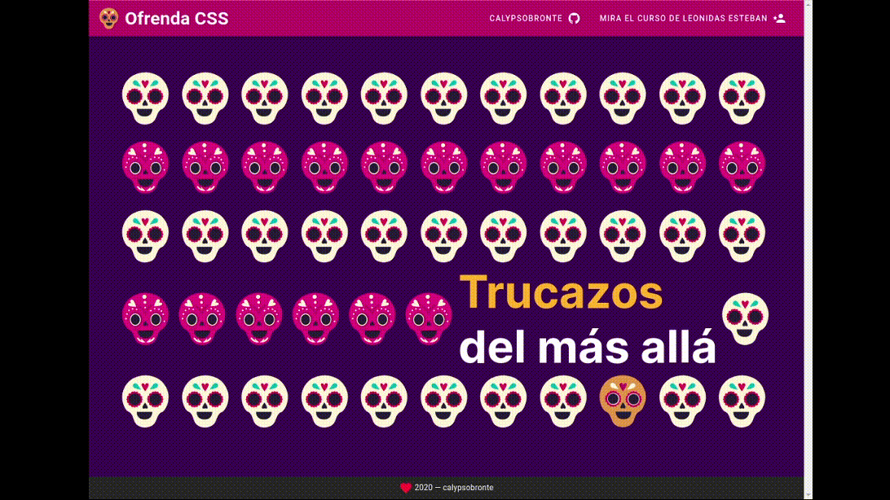

## Frontend *(vuejs2, vuetify)*



### Instalación

* Clona el repositorio por medio de git
```bash
$ git clone https://gitlab.com/IndieLevelStudio/lina-test.git
```

1. Ingresar al directorio clonado `lina-test/frontend`

```bash
$ cd frontend
```

2. Instalar las dependencias para correr el server

```bash
$ yarn install
```

3. Inicie el servidor de desarrollo:
```bash
$ yarn serve
```

4. Abra el sitio de desarrollo yendo a `http://localhost:8080` en su navegador.

### Customize configuration
See [Configuration Reference](https://cli.vuejs.org/config/).


## Construido con

* Ubuntu Server 20
* Visual Studio Code Insiders
* AWS


## Diseños
[Cristopher • UX/UI Designer](https://www.instagram.com/uxcristopher/?hl=es-la)


## Contribuyendo

Contribuya usando GitHub Flow. Cree una rama, agregue confirmaciones y abra una solicitud de extracción .

## Versionado

v1

## Autores

* **Lina María Montaño Ramírez** - *Backend Developer* - [calypsobronte](https://github.com/calypsobronte)


## Licencia

 MIT License 
